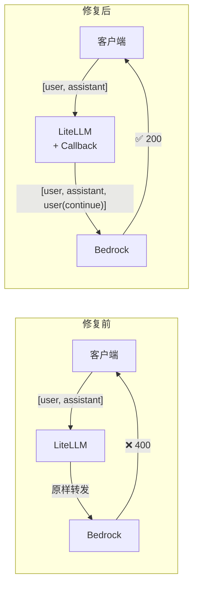
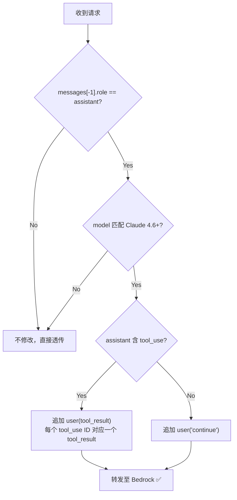
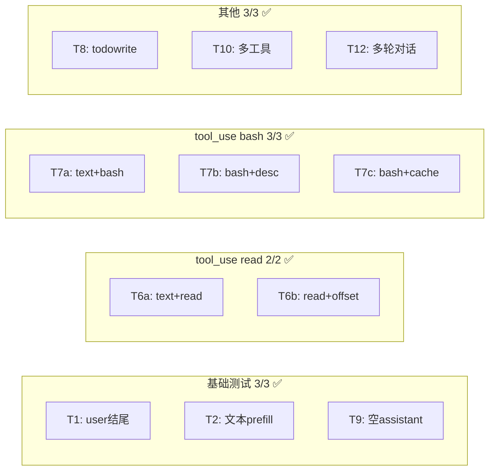
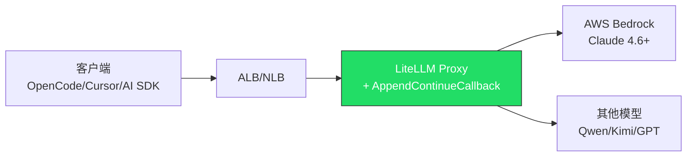

# Claude 4.6+ Prefill Auto-Fix for LiteLLM on AWS

> **LiteLLM Custom Callback** — 自动修复 Claude 4.6+ 的 `assistant message prefill` 400 错误，零代码改动即可让现有客户端继续工作。

[](LICENSE)

---

## 问题背景

从 **Claude Sonnet 4.6** 起，Anthropic 移除了 assistant message prefill 支持。当对话以 assistant 消息结尾时，AWS Bedrock 返回：

```
400: "This model does not support assistant message prefill.
      The conversation must end with a user message."
```

**影响范围**：所有通过 LiteLLM Proxy 调用 Claude 4.6+ 的客户端（OpenCode、AI SDK、Cursor 等），尤其是 Coding Agent 场景中的 tool_use 多轮对话。

**生产数据**：24 小时内 **862 次** prefill error，峰值 746 次/小时。

---

## 解决方案



通过 LiteLLM 的 **Custom Callback Hook**，在请求转发前自动检测并追加 user 消息：

| 场景 | 追加内容 |
|------|---------|
| assistant 纯文本 | `{"role": "user", "content": "continue"}` |
| assistant 含 tool_use | `{"role": "user", "content": [{"type": "tool_result", ...}]}` |
| 非 Claude 4.6+ 模型 | 不修改（透传） |
| 正常 user 结尾 | 不修改（透传） |

---

## 核心逻辑



### 为什么需要 tool_result？

Anthropic API 要求：每个 `tool_use` 块必须在紧随其后的 user 消息中有对应的 `tool_result`。简单追加 `"continue"` 文本会触发另一个 400 错误。

---

## 模型匹配规则

基于 [Anthropic Migration Guide](https://platform.claude.com/docs/en/about-claude/models/migration-guide)：

| 模型 | 支持 Prefill | 触发 Callback |
|------|:-----------:|:------------:|
| Claude 3.x (Haiku/Sonnet/Opus) | ✅ | ❌ |
| Claude Sonnet 4.5 / Haiku 4.5 | ✅ | ❌ |
| **Claude Sonnet 4.6** | ❌ | ✅ |
| **Claude Opus 4.6** | ❌ | ✅ |
| **Claude Opus 4.7** | ❌ | ✅ |
| **Claude Mythos** | ❌ | ✅ |
| 未来 Claude 4.6+ | ❌ | ✅ |
| Qwen / Kimi / GPT 等 | ✅ | ❌ |

```python
# 正则匹配：claude-{family}-4-{6+} 或 claude-mythos
_NO_PREFILL_RE = re.compile(
    r"claude-(?:sonnet|opus|haiku)-4-([6-9]|\d{2,})"
    r"|claude-(?:sonnet|opus|haiku)-([5-9]|\d{2,})-"
    r"|claude-mythos"
)
```

---

## 快速部署（3 步）

### 方式一：Docker 镜像（推荐）

```dockerfile
FROM ghcr.io/berriai/litellm:main-latest
COPY custom_callbacks.py /app/custom_callbacks.py
```

### 方式二：已有 LiteLLM 部署

将 `src/custom_callbacks.py` 复制到 LiteLLM 容器的 `/app/` 目录。

### 配置注册

在 `config.yaml` 中添加一行：

```yaml
litellm_settings:
  callbacks: custom_callbacks.proxy_handler_instance
```

重启 LiteLLM Proxy 即可生效。

---

## 测试验证

### 测试矩阵（11 项全部通过 ✅）



| # | 场景 | 来源 | 结果 |
|---|------|------|------|
| T1 | 正常 user 结尾（不触发） | 基础 | ✅ 200 |
| T2 | assistant 纯文本 prefill | 基础 | ✅ 200 |
| T9 | 空 assistant 消息 | 生产样本8 | ✅ 200 |
| T6a | text + tool_use(read) | 生产样本1 | ✅ 200 |
| T6b | 纯 tool_use(read) + offset/limit | 生产样本2,3,9 | ✅ 200 |
| T7a | text + tool_use(bash) | 生产样本5,10 | ✅ 200 |
| T7b | 纯 tool_use(bash) + description | 生产样本6 | ✅ 200 |
| T7c | 纯 tool_use(bash) + timeout + cache_control | 生产样本7 | ✅ 200 |
| T8 | text + tool_use(todowrite) + cache_control | 生产样本4 | ✅ 200 |
| T10 | 多个 tool_use（2个工具同时） | 边界 | ✅ 200 |
| T12 | 多轮对话末尾 assistant | 边界 | ✅ 200 |

> **生产样本覆盖率: 100%** — 所有 10 个生产 Prefill Error 样本的触发模式均有对应测试覆盖。

### 推理质量验证

基于 9 类用例的矩阵测试（事实问答、代码生成、JSON、分类、数学、长文本、多轮对话、Tool Use、翻译）：

| 维度 | 结论 |
|------|------|
| 推理正确性 | ✅ 不受影响 |
| 输出格式 | ✅ 不受影响 |
| 工具调用 | ✅ 不受影响 |
| 多轮上下文 | ✅ 不受影响 |
| 结果稳定性 | ✅ 重复测试 100% 一致 |
| Token 开销 | ⚠️ input +10~20 tokens（可忽略） |

---

## 项目结构

```
├── README.md                 # 本文档
├── LICENSE
├── src/
│   ├── custom_callbacks.py   # 核心代码（89 行）
│   ├── config.yaml           # LiteLLM 配置示例
│   ├── Dockerfile            # 容器构建
│   └── Dockerfile.deploy     # 基于已有 ECR 镜像的增量构建
├── tests/
│   ├── test_model_matching.py  # 模型匹配单元测试
│   └── test_live.sh            # 线上验证脚本（11 项）
└── docs/
    ├── requirements.md         # 完整需求规格
    ├── deployment-report.md    # 部署过程报告
    └── test-matrix-report.md   # 测试矩阵详细报告
```

---

## 最佳实践

### 1. 部署建议

- **先在 Testing 环境验证**，确认 callback 日志正常后再推 Production
- 使用 `LITELLM_LOG=DEBUG` 可在 CloudWatch 中看到 `[AppendContinueCallback]` 日志
- 建议使用 Docker 镜像方式（callback 文件 baked in），避免运行时下载依赖

### 2. 监控

部署后关注以下指标：
- CloudWatch 日志中 `[AppendContinueCallback]` 出现频率（= 被修复的请求数）
- Bedrock 400 错误率应降至 0
- 响应延迟无明显变化（callback 逻辑 < 1ms）

### 3. 回滚

如需回滚，只需将 ECS Task Definition 切回旧版本：

```bash
aws ecs update-service --cluster YOUR_CLUSTER --service YOUR_SERVICE \
  --task-definition YOUR_OLD_TASK_DEF --force-new-deployment
```

### 4. 与 v1 (Strip) 方案的对比

| 维度 | v1 Strip | v2 Append Continue |
|------|---------|-------------------|
| 策略 | 删除尾部 assistant | 追加 user 消息 |
| 上下文保留 | ❌ 丢失 prefill 内容 | ✅ 完整保留 |
| tool_use 支持 | ❌ 不处理 | ✅ 自动生成 tool_result |
| 模型过滤 | ❌ 所有模型 | ✅ 仅 Claude 4.6+ |
| 推理质量 | ⚠️ 可能偏差 | ✅ 矩阵测试验证无损 |

### 5. 适用架构



适用于所有基于 [guidance-for-multi-provider-generative-ai-gateway-on-aws](https://github.com/aws-solutions-library-samples/guidance-for-multi-provider-generative-ai-gateway-on-aws) 架构的 LiteLLM 部署。

---

## 参考链接

- [Anthropic Migration Guide — Prefill Removal](https://platform.claude.com/docs/en/about-claude/models/migration-guide)
- [LiteLLM Issue #22930](https://github.com/BerriAI/litellm/issues/22930)
- [LiteLLM Custom Callbacks 文档](https://docs.litellm.ai/docs/proxy/call_hooks)
- [AWS Multi-Provider AI Gateway](https://github.com/aws-solutions-library-samples/guidance-for-multi-provider-generative-ai-gateway-on-aws)

---

## License

MIT
