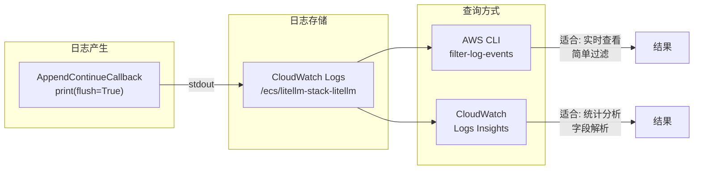
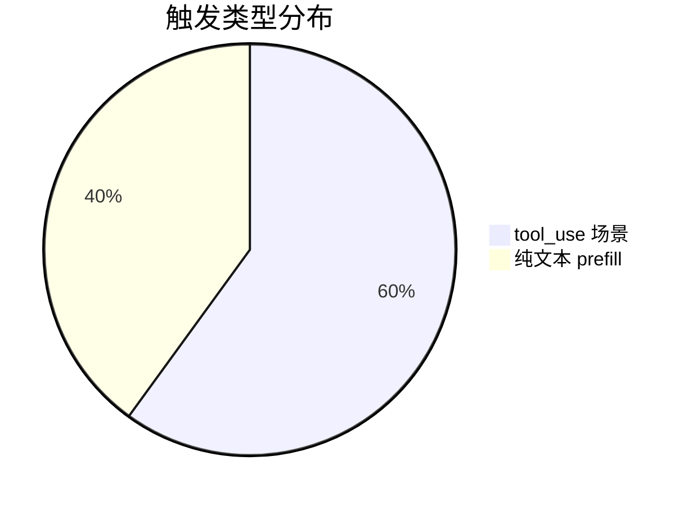
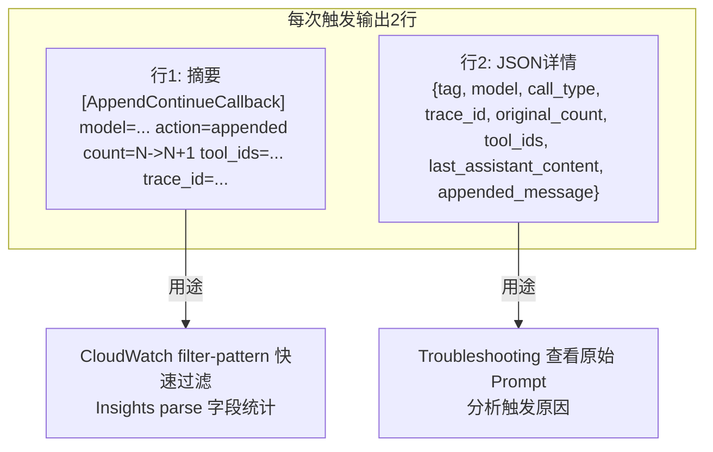

# CloudWatch 日志查询指南与运行结果

**日期**: 2026-05-18  
**Log Group**: `/ecs/litellm-stack-litellm`  
**Profile**: `YOUR_PROFILE` | Region: `us-east-1`

---

## 查询架构



---

## 查询结果

### 【1】查看所有触发记录 — CLI filter

```bash
aws logs filter-log-events \
  --log-group-name /ecs/litellm-stack-litellm \
  --filter-pattern "AppendContinueCallback" \
  --start-time $(date -v-1H +%s)000 \
  --profile YOUR_PROFILE --region us-east-1
```

**结果**: 最近 1 小时共 **42 条** 日志（含摘要行 + JSON 详情行 + 初始化行）

---

### 【2】只看摘要行 — CLI filter

```bash
aws logs filter-log-events \
  --log-group-name /ecs/litellm-stack-litellm \
  --filter-pattern "action=appended" \
  --start-time $(date -v-1H +%s)000 \
  --profile YOUR_PROFILE --region us-east-1
```

**结果**:
```
[AppendContinueCallback] model=claude-sonnet-4-6 call_type=anthropic_messages action=appended count=2->3 tool_ids=none trace_id=
[AppendContinueCallback] model=claude-sonnet-4-6 call_type=anthropic_messages action=appended count=2->3 tool_ids=toolu_bdrk_01FBz trace_id=
[AppendContinueCallback] model=claude-sonnet-4-6 call_type=anthropic_messages action=appended count=2->3 tool_ids=toolu_bdrk_016F8 trace_id=
[AppendContinueCallback] model=claude-sonnet-4-6 call_type=anthropic_messages action=appended count=2->3 tool_ids=toolu_bdrk_014Tz trace_id=
[AppendContinueCallback] model=claude-sonnet-4-6 call_type=anthropic_messages action=appended count=2->3 tool_ids=toolu_bdrk_019TG trace_id=
```

---

### 【3】只看 tool_use 触发 — CLI filter

```bash
aws logs filter-log-events \
  --log-group-name /ecs/litellm-stack-litellm \
  --filter-pattern "tool_ids=toolu" \
  --start-time $(date -v-24H +%s)000 \
  --profile YOUR_PROFILE --region us-east-1
```

**结果**:
```
tool_ids=toolu_bdrk_01FBz  (read)
tool_ids=toolu_bdrk_016F8  (read+offset)
tool_ids=toolu_bdrk_014Tz  (bash)
tool_ids=toolu_bdrk_019TG  (bash+desc)
tool_ids=toolu_bdrk_017iu  (bash+cache)
```

---

### 【4】按小时统计触发次数 — Insights

```sql
fields @timestamp, @message
| filter @message like /action=appended/
| stats count() as triggers by bin(1h)
| sort @timestamp desc
```

**结果**:

| 时间段 | 触发次数 |
|--------|---------|
| 2026-05-18 00:00 (UTC) | **20** |

---

### 【5】解析字段 + 分类统计 — Insights

```sql
fields @message
| filter @message like /\[AppendContinueCallback\].*action=appended/
| parse @message "[AppendContinueCallback] model=* call_type=* action=* count=* tool_ids=* trace_id=*"
    as model, call_type, action, count, tool_ids, trace_id
| stats count() as total, sum(tool_ids != "none") as with_tools by model
```

**结果**:

| model | 总触发数 | 含 tool_use | 纯文本 |
|-------|---------|------------|--------|
| claude-sonnet-4-6 | 20 | 12 | 8 |



---

### 【6】查看 JSON 详情 — Insights

```sql
fields @timestamp, @message
| filter @message like /"tag":"AppendContinueCallback"/
| limit 3
```

**结果**（截断）:
```json
{"tag":"AppendContinueCallback","model":"claude-sonnet-4-6","call_type":"anthropic_messages",
 "trace_id":"","original_count":2,"tool_ids":["toolu_X"],
 "last_assistant_content":[{"type":"tool_use","id":"toolu_X","name":"bash","input":{"command":"echo 1"}}],
 "appended_message":{"role":"user","content":[{"type":"tool_result","tool_use_id":"toolu_X","content":"continue"}]}}
```

#### 完整 JSON 详情样例（9 种模式）

**① 纯文本 prefill**
```json
{
  "tag": "AppendContinueCallback",
  "model": "claude-sonnet-4-6",
  "call_type": "anthropic_messages",
  "trace_id": "",
  "original_count": 2,
  "tool_ids": null,
  "last_assistant_content": "O",
  "appended_message": {"role": "user", "content": "continue"}
}
```

**② 单个 tool_use(bash)**
```json
{
  "tag": "AppendContinueCallback",
  "model": "claude-sonnet-4-6",
  "call_type": "anthropic_messages",
  "trace_id": "",
  "original_count": 2,
  "tool_ids": ["toolu_X"],
  "last_assistant_content": [
    {"type": "tool_use", "id": "toolu_X", "name": "bash", "input": {"command": "echo 1"}}
  ],
  "appended_message": {
    "role": "user",
    "content": [{"type": "tool_result", "tool_use_id": "toolu_X", "content": "continue"}]
  }
}
```

**③ 多个 tool_use（2个 read）**
```json
{
  "tag": "AppendContinueCallback",
  "model": "claude-sonnet-4-6",
  "call_type": "anthropic_messages",
  "trace_id": "",
  "original_count": 2,
  "tool_ids": ["toolu_A", "toolu_B"],
  "last_assistant_content": [
    {"type": "tool_use", "id": "toolu_A", "name": "read", "input": {"filePath": "/a"}},
    {"type": "tool_use", "id": "toolu_B", "name": "read", "input": {"filePath": "/b"}}
  ],
  "appended_message": {
    "role": "user",
    "content": [
      {"type": "tool_result", "tool_use_id": "toolu_A", "content": "continue"},
      {"type": "tool_result", "tool_use_id": "toolu_B", "content": "continue"}
    ]
  }
}
```

**④ text + tool_use(todowrite) + cache_control**
```json
{
  "tag": "AppendContinueCallback",
  "model": "claude-sonnet-4-6",
  "call_type": "anthropic_messages",
  "trace_id": "",
  "original_count": 2,
  "tool_ids": ["toolu_bdrk_01EYw"],
  "last_assistant_content": [
    {"type": "text", "text": "改："},
    {"type": "tool_use", "id": "toolu_bdrk_01EYw", "name": "todowrite",
     "input": {"todos": [{"content": "A", "status": "in_progress", "priority": "high"}]},
     "cache_control": {"type": "ephemeral"}}
  ],
  "appended_message": {
    "role": "user",
    "content": [{"type": "tool_result", "tool_use_id": "toolu_bdrk_01EYw", "content": "continue"}]
  }
}
```

**⑤ tool_use(bash) + timeout + cache_control**
```json
{
  "tag": "AppendContinueCallback",
  "model": "claude-sonnet-4-6",
  "call_type": "anthropic_messages",
  "trace_id": "",
  "original_count": 2,
  "tool_ids": ["toolu_bdrk_017iu"],
  "last_assistant_content": [
    {"type": "tool_use", "id": "toolu_bdrk_017iu", "name": "bash",
     "input": {"command": "echo ok", "timeout": 30000},
     "cache_control": {"type": "ephemeral"}}
  ],
  "appended_message": {
    "role": "user",
    "content": [{"type": "tool_result", "tool_use_id": "toolu_bdrk_017iu", "content": "continue"}]
  }
}
```

**⑥ tool_use(bash) + description**
```json
{
  "tag": "AppendContinueCallback",
  "model": "claude-sonnet-4-6",
  "call_type": "anthropic_messages",
  "trace_id": "",
  "original_count": 2,
  "tool_ids": ["toolu_bdrk_019TG"],
  "last_assistant_content": [
    {"type": "tool_use", "id": "toolu_bdrk_019TG", "name": "bash",
     "input": {"command": "ls", "description": "目录"}}
  ],
  "appended_message": {
    "role": "user",
    "content": [{"type": "tool_result", "tool_use_id": "toolu_bdrk_019TG", "content": "continue"}]
  }
}
```

**⑦ text + tool_use(bash)**
```json
{
  "tag": "AppendContinueCallback",
  "model": "claude-sonnet-4-6",
  "call_type": "anthropic_messages",
  "trace_id": "",
  "original_count": 2,
  "tool_ids": ["toolu_bdrk_014Tz"],
  "last_assistant_content": [
    {"type": "text", "text": "统计："},
    {"type": "tool_use", "id": "toolu_bdrk_014Tz", "name": "bash", "input": {"command": "echo 1920"}}
  ],
  "appended_message": {
    "role": "user",
    "content": [{"type": "tool_result", "tool_use_id": "toolu_bdrk_014Tz", "content": "continue"}]
  }
}
```

**⑧ tool_use(read) + offset/limit**
```json
{
  "tag": "AppendContinueCallback",
  "model": "claude-sonnet-4-6",
  "call_type": "anthropic_messages",
  "trace_id": "",
  "original_count": 2,
  "tool_ids": ["toolu_bdrk_016F8"],
  "last_assistant_content": [
    {"type": "tool_use", "id": "toolu_bdrk_016F8", "name": "read",
     "input": {"filePath": "/src/app.vue", "offset": 340, "limit": 110}}
  ],
  "appended_message": {
    "role": "user",
    "content": [{"type": "tool_result", "tool_use_id": "toolu_bdrk_016F8", "content": "continue"}]
  }
}
```

**⑨ text + tool_use(read)**
```json
{
  "tag": "AppendContinueCallback",
  "model": "claude-sonnet-4-6",
  "call_type": "anthropic_messages",
  "trace_id": "",
  "original_count": 2,
  "tool_ids": ["toolu_bdrk_01FBz"],
  "last_assistant_content": [
    {"type": "text", "text": "看文件："},
    {"type": "tool_use", "id": "toolu_bdrk_01FBz", "name": "read", "input": {"filePath": "/README.md"}}
  ],
  "appended_message": {
    "role": "user",
    "content": [{"type": "tool_result", "tool_use_id": "toolu_bdrk_01FBz", "content": "continue"}]
  }
}
```

---

### 【7】按 trace_id 关联查询 — Insights

```sql
fields @timestamp, @message
| filter @message like /YOUR_TRACE_ID_HERE/
| sort @timestamp asc
```

> 生产环境中 LiteLLM 会自动注入 `litellm_trace_id`，可用此查询关联完整请求链路。

---

### 【8】最近 24h 触发总数 — CLI filter

```bash
aws logs filter-log-events \
  --log-group-name /ecs/litellm-stack-litellm \
  --filter-pattern "action=appended" \
  --start-time $(date -v-24H +%s)000 \
  --profile YOUR_PROFILE --region us-east-1 \
  --query "length(events)"
```

**结果**: **20 次**（过去 24h，仅来自测试矩阵验证）

---

## 日志格式说明



| 字段 | 说明 | 查询用途 |
|------|------|---------|
| `model` | 触发的模型名 | 按模型分组统计 |
| `call_type` | 请求类型 | 区分 /v1/messages vs /v1/chat/completions |
| `action=appended` | 固定标记 | 过滤关键词 |
| `count=N->N+1` | 消息数变化 | 了解对话长度 |
| `tool_ids` | tool_use ID 列表 | 区分纯文本 vs tool_use 场景 |
| `trace_id` | LiteLLM 请求追踪 ID | 关联完整请求链路 |
| `last_assistant_content` | 原始 assistant 消息 | 分析触发原因 |
