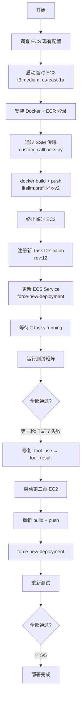
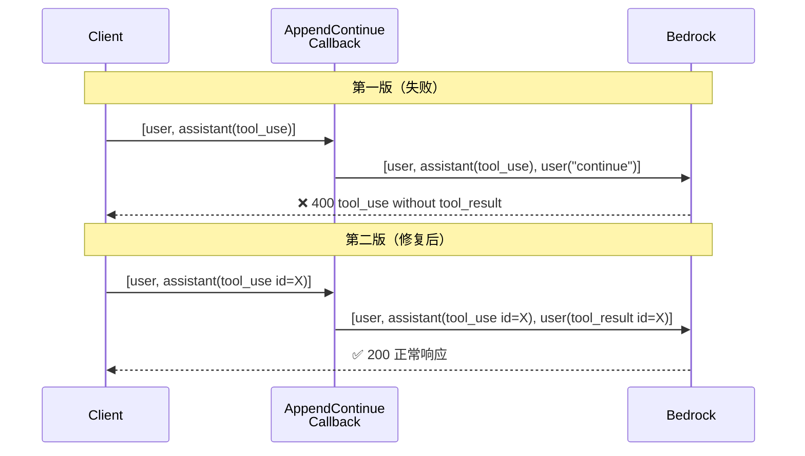
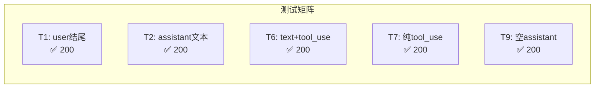
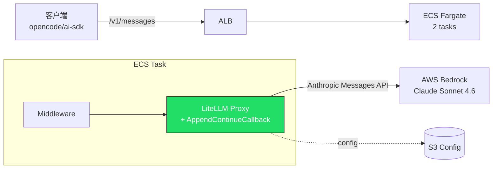

# AppendContinueCallback v2 — 部署与测试报告

**日期**: 2026-05-15 22:00-22:40 CST  
**环境**: Testing (us-east-1)  
**结果**: ✅ 5/5 测试通过

---

## 部署流程



---

## 部署详情

| 步骤 | 操作 | 结果 |
|------|------|------|
| 1 | 调查 ECS 配置 | cluster=litellm-stack-cluster, service=LiteLLMService, task-def:6 |
| 2 | 启动 EC2 (i-00b88fd90a3c69fb0) | AL2023, t3.medium, us-east-1a |
| 3 | Docker build + push (第一版) | ✅ sha256:3f0a491c... |
| 4 | 注册 task-def:12, 更新 service | ✅ 2 tasks running |
| 5 | 运行测试 T1/T2/T9 | ✅ 通过 |
| 6 | 运行测试 T6/T7 | ❌ 400 tool_use without tool_result |
| 7 | **修复代码**: tool_use → append tool_result | 代码更新 |
| 8 | 启动 EC2 (i-0ff03d6f83226b1a8) | 重新构建 |
| 9 | Docker build + push (第二版) | ✅ sha256:46144fbc... |
| 10 | force-new-deployment | ✅ 2 tasks running |
| 11 | 运行全部测试 T1/T2/T6/T7/T9 | ✅ **5/5 通过** |
| 12 | 终止所有临时 EC2 | ✅ 已清理 |

---

## 关键修复：tool_use 场景



### 修复逻辑

```python
def _build_user_message(content):
    tool_ids = _extract_tool_use_ids(content)
    if tool_ids:
        # tool_use 场景：必须用 tool_result 回复
        return {"role": "user", "content": [
            {"type": "tool_result", "tool_use_id": tid, "content": "continue"}
            for tid in tool_ids
        ]}
    # 普通文本场景
    return {"role": "user", "content": "continue"}
```

---

## 测试结果



| 测试 | 场景 | 预期 | 实际 | 状态 |
|------|------|------|------|------|
| T1 | 正常 user 结尾 | 200 (不触发) | 200 | ✅ |
| T2 | assistant 文本 prefill | 200 (追加 continue) | 200 | ✅ |
| T6 | text + tool_use(read) | 200 (追加 tool_result) | 200 | ✅ |
| T7 | 纯 tool_use(bash) | 200 (追加 tool_result) | 200 | ✅ |
| T9 | 空 assistant 消息 | 200 (追加 continue) | 200 | ✅ |

---

## 部署产物

| 产物 | 值 |
|------|-----|
| ECR Image | `153705321444.dkr.ecr.us-east-1.amazonaws.com/litellm:prefill-fix-v2` |
| Image Digest | `sha256:46144fbc8258d16ef7ae37475413f85144bf1f059e210aee58ff0832dc25ce7d` |
| Task Definition | `litellm-stack-fargate-task:12` |
| S3 Config | `s3://litellm-config-20260411101252843700000006/config.yaml` (含 callbacks) |
| 回调文件 | `/app/custom_callbacks.py` (baked in image) |

---

## 架构总览



---

## 回滚方案

如需回滚，将 ECS service 切回旧 task definition:

```bash
aws ecs update-service \
  --cluster litellm-stack-cluster \
  --service LiteLLMService \
  --task-definition litellm-stack-fargate-task:6 \
  --force-new-deployment \
  --profile oversea1 --region us-east-1
```
