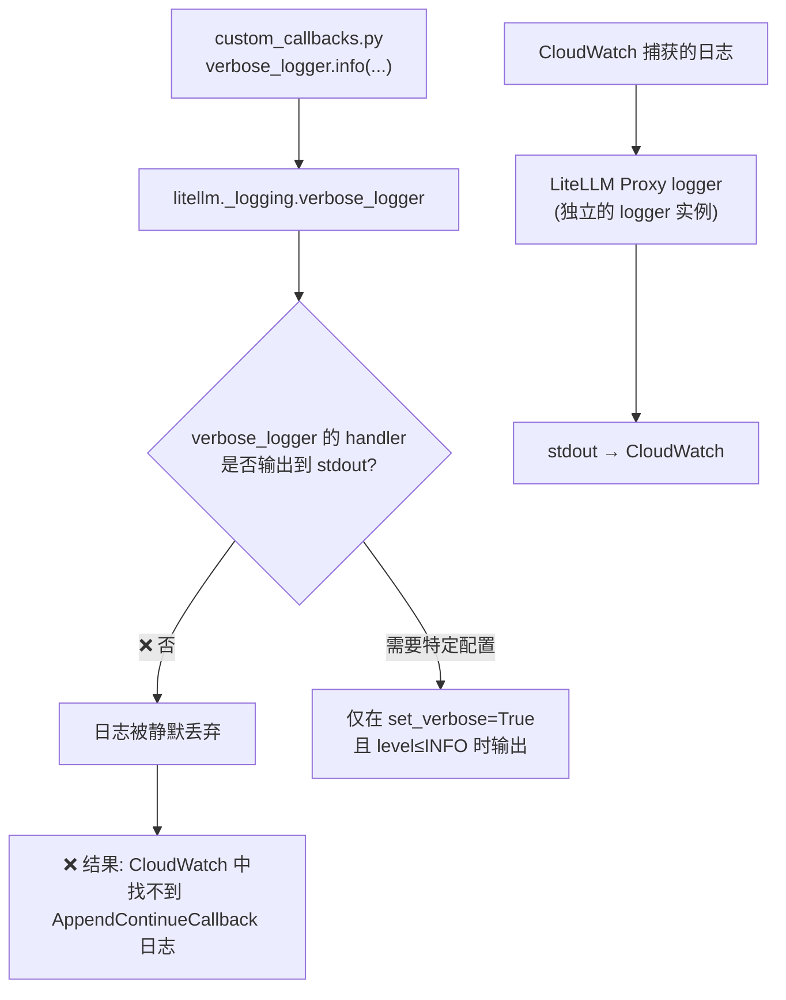

# AppendContinueCallback 日志功能修复需求

**日期**: 2026-05-18  
**状态**: 待确认  
**问题**: `[AppendContinueCallback]` 日志在 CloudWatch 和容器中均不可见

---

## 一、问题诊断

### 1.1 根因



| 检查项 | 结果 |
|--------|------|
| `AppendContinueCallback` 是否加载 | ✅ 已加载（CloudWatch 有 "Initialized Callbacks" 日志） |
| `verbose_logger.info()` 输出是否可见 | ❌ **不可见**（搜索 0 条结果） |
| CloudWatch 中有哪些日志 | 仅 `LiteLLM Proxy:DEBUG` 级别（来自 proxy logger） |
| `verbose_logger` 为什么不输出 | LiteLLM 内部控制，INFO 级别未路由到 stdout |

### 1.2 根本原因

`litellm._logging.verbose_logger` 是 LiteLLM 内部的日志器，其输出依赖于：
- `litellm.set_verbose = True`（运行时设置）
- logger handler 配置（由 LiteLLM 框架控制）

**即使环境变量 `LITELLM_LOG=DEBUG`，也只控制 Proxy Logger，不控制 verbose_logger。**

---

## 二、解决方案

### 方案：使用 Python 标准 `print()` + 结构化前缀

**原理**：ECS Fargate 容器的 stdout 直接进入 CloudWatch。`print()` 不依赖任何日志框架配置，100% 可靠。

```python
# 替代 verbose_logger.info(...)
print(f"[AppendContinueCallback] model={model} call_type={call_type} action=appended original={len(messages)} tool_ids={tool_ids or 'none'}")
```

**优势**：
- ✅ 不依赖 LiteLLM 日志系统
- ✅ 不依赖日志级别配置
- ✅ stdout → CloudWatch 直接可见
- ✅ 结构化格式便于 CloudWatch Insights 查询
- ✅ 零外部依赖

### 查询方式

```sql
-- CloudWatch Logs Insights
fields @timestamp, @message
| filter @message like /AppendContinueCallback/
| parse @message "model=* call_type=* action=* original=* tool_ids=*" as model, call_type, action, orig_count, tools
| stats count() by bin(1h)
```

---

## 三、代码变更

```python
# 旧代码
from litellm._logging import verbose_logger
verbose_logger.info(f"[AppendContinueCallback] ...")

# 新代码
import sys
print(f"[AppendContinueCallback] model={model} call_type={call_type} action=appended count={len(messages)}->{len(messages)+1} tool_ids={tool_ids or 'none'}", flush=True)
```

> `flush=True` 确保日志立即写入 stdout，不被 Python 缓冲。

---

## 四、日志格式设计

### 触发时

```
[AppendContinueCallback] model=claude-sonnet-4-6 call_type=anthropic_messages action=appended count=5->6 tool_ids=toolu_01A,toolu_01B
```

### 不触发时（可选，默认关闭）

不记录不触发的请求，避免日志量过大。

---

## 五、Questions

### [Question] Q1: 是否需要记录不触发的请求？

当前方案只在 callback 实际追加消息时记录日志。是否也需要记录「检测到 assistant 结尾但模型不匹配，所以跳过」的情况？

> 考虑：不触发的请求可能占大多数（非 Claude 4.6+ 模型），记录会产生大量日志。

[Answer] 不触发不记录。 触发的需要记录日志详情（原始Prompt信息）

**✅ 已确认 — 仅触发时记录，包含原始 assistant 消息内容。**

---

### [Question] Q2: 日志中是否需要包含请求标识？

是否需要在日志中包含 `request_id` 或 `trace_id` 以便关联到具体请求？LiteLLM 的 `data` 字典中可能包含 `litellm_trace_id`。

[Answer]  需要包含，以便troubshooting的时候做关联查询到litellm；

**✅ 已确认 — 包含 trace_id。**

---

### [Question] Q3: 日志格式偏好

以下两种格式，哪种更适合你的查询习惯？

**A) 单行键值对**（便于 CloudWatch Insights parse）：

```
[AppendContinueCallback] model=claude-sonnet-4-6 call_type=anthropic_messages action=appended count=5->6 tool_ids=toolu_01A
```

**B) JSON 格式**（便于程序化处理）：
```json
{"tag":"AppendContinueCallback","model":"claude-sonnet-4-6","call_type":"anthropic_messages","action":"appended","count":"5->6","tool_ids":["toolu_01A"]}
```

[Answer]  都需要。 A为简单格式便于 CloudWatch Insights parse，B增加 日志详情（原始Prompt信息）

**✅ 已确认 — 双行输出：A 摘要 + B JSON 详情。**

---

## 六、部署验证结果（2026-05-18）

### 测试矩阵: 11/11 通过 ✅

### CloudWatch 日志验证: ✅ 可见

**摘要行示例**：
```
[AppendContinueCallback] model=claude-sonnet-4-6 call_type=anthropic_messages action=appended count=2->3 tool_ids=toolu_bdrk_01FBz trace_id=
```

**JSON 详情示例**：
```json
{"tag":"AppendContinueCallback","model":"claude-sonnet-4-6","call_type":"anthropic_messages","trace_id":"","original_count":2,"tool_ids":null,"last_assistant_content":"Amazon ECS是","appended_message":{"role":"user","content":"continue"}}
```

### 性能影响: 无

| 场景 | 平均响应时间 |
|------|------------|
| A: 不触发 | 2.08s |
| B: 触发(文本+日志) | 2.52s |
| C: 触发(tool_use+JSON日志) | 2.50s |

> 差异来自 Bedrock 推理时间波动，print 两行日志 < 1ms。

---
