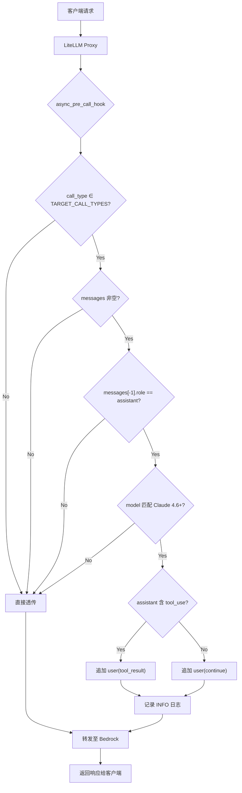
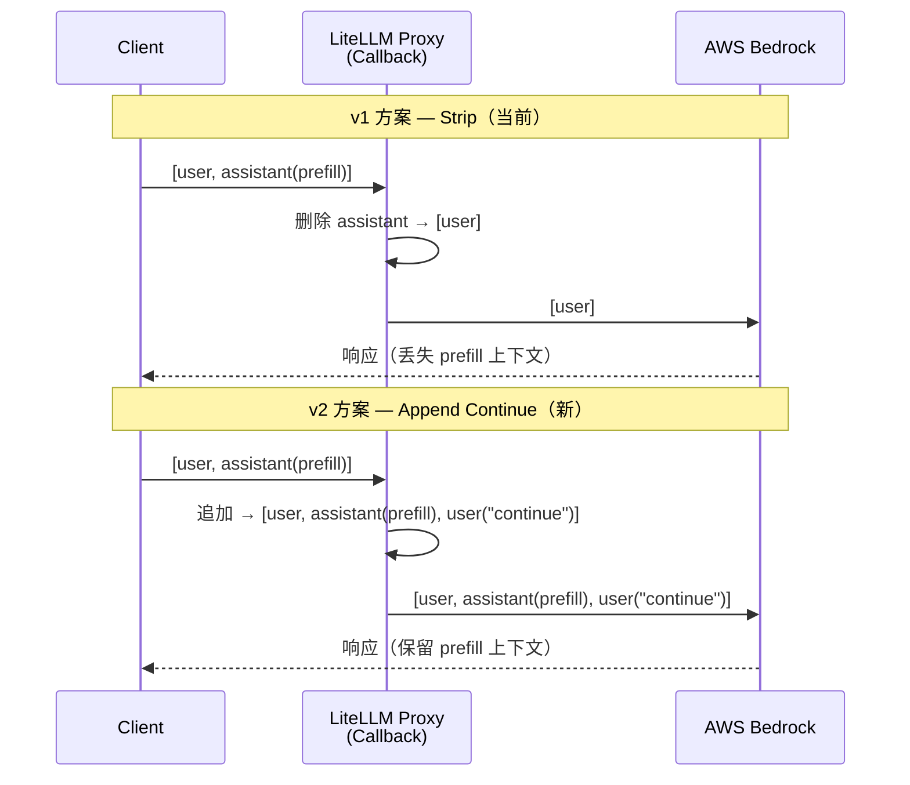
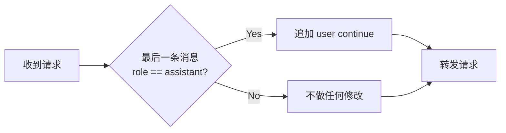

# Claude 4.6 Prefill Auto-Fix v2 — 需求规格文档

**版本**: v2.0  
**日期**: 2026-05-15  
**状态**: 待确认  
**变更摘要**: 将 StripPrefillCallback 的逻辑从「删除尾部 assistant 消息」改为「追加 user continue 消息」

---

## 一、变更背景

### 1.1 当前实现（v1 — Strip 方案）

现有 `StripPrefillCallback` 在检测到 `messages[-1].role == "assistant"` 时，直接删除该消息：

```python
# 当前逻辑 (v1)
data["messages"] = messages[:-1]  # 丢弃 assistant prefill
```

**问题**：删除 assistant 消息会丢失用户意图中的上下文约束（如指定回答方向、格式引导等），导致模型输出可能偏离预期。

### 1.2 新方案（v2 — Append Continue 方案）

改为在尾部追加 `{"role": "user", "content": "continue"}`：

```python
# 新逻辑 (v2)
data["messages"] = messages + [{"role": "user", "content": "continue"}]
```

**优势**：保留完整对话上下文，模型能看到 assistant prefill 内容并据此继续生成。矩阵测试已验证该方案与正常 user 结尾的推理结果 100% 一致。

---

## 二、架构流程图

### 2.1 请求处理流程



### 2.2 v1 vs v2 对比



### 2.3 判断逻辑决策树



---

## 三、功能需求

### 3.1 核心逻辑

| # | 需求 | 优先级 |
|---|------|--------|
| R1 | 当 `messages[-1].role == "assistant"` 时，追加 `{"role": "user", "content": "continue"}` | P0 |
| R2 | 当 `messages[-1].role != "assistant"` 时，不做任何修改 | P0 |
| R3 | 仅对 `TARGET_CALL_TYPES` 中的 call_type 生效 | P0 |
| R4 | 空 messages 列表不处理 | P0 |
| R5 | 记录 INFO 级别日志，包含 model、call_type、原始消息数、新消息数 | P1 |

### 3.2 日志格式

```
[AppendContinueCallback] Appended user 'continue' message for model={model} call_type={call_type}. Original count={N}, new count={N+1}.
```

### 3.3 不变约束

- `TARGET_CALL_TYPES` 保持不变：`{"completion", "acompletion", "anthropic_messages"}`
- 回调注册方式不变：`proxy_handler_instance = AppendContinueCallback()`
- config.yaml 引用路径不变：`custom_callbacks.proxy_handler_instance`

---

## 四、代码变更范围

### 4.1 文件清单

| 文件 | 变更类型 | 说明 |
|------|---------|------|
| `src/custom_callbacks.py` | 修改 | 核心逻辑变更 |
| `src/config.yaml` | 不变 | 回调引用路径不变 |
| `src/Dockerfile` | 不变 | 无依赖变化 |

### 4.2 最终实现代码

```python
_NO_PREFILL_RE = re.compile(
    r"claude-(?:sonnet|opus|haiku)-4-([6-9]|\d{2,})"
    r"|claude-(?:sonnet|opus|haiku)-([5-9]|\d{2,})-"
    r"|claude-mythos"
)

def _model_needs_fix(model: str) -> bool:
    """仅对 Claude 4.6+ 模型触发。"""
    return bool(_NO_PREFILL_RE.search(model.lower()))

def _extract_tool_use_ids(content) -> list:
    """提取 assistant 消息中的 tool_use ID。"""
    if isinstance(content, list):
        return [b["id"] for b in content if isinstance(b, dict) and b.get("type") == "tool_use"]
    return []

def _build_user_message(content) -> dict:
    """构建追加的 user 消息。
    - 有 tool_use → 追加 tool_result（Bedrock API 要求）
    - 无 tool_use → 追加 "continue"
    """
    tool_ids = _extract_tool_use_ids(content)
    if tool_ids:
        return {"role": "user", "content": [
            {"type": "tool_result", "tool_use_id": tid, "content": "continue"}
            for tid in tool_ids
        ]}
    return {"role": "user", "content": "continue"}

class AppendContinueCallback(CustomLogger):
    async def async_pre_call_hook(self, user_api_key_dict, cache, data, call_type):
        if call_type not in TARGET_CALL_TYPES:
            return data
        messages = data.get("messages", [])
        if not messages:
            return data
        last_msg = messages[-1]
        if not isinstance(last_msg, dict) or last_msg.get("role") != "assistant":
            return data
        model = data.get("model", "")
        if not _model_needs_fix(model):
            return data
        user_msg = _build_user_message(last_msg.get("content"))
        data["messages"] = messages + [user_msg]
        return data
```

> **关键设计决策**：当 assistant 消息含 `tool_use` 时，Bedrock 要求下一条 user 消息必须包含对应的 `tool_result`，否则返回 400。因此不能简单追加 `"continue"` 文本。

---

## 五、测试验证计划

### 5.1 部署环境

| 项目 | 值 |
|------|-----|
| AWS Profile | `YOUR_PROFILE` |
| Region | `us-east-1` |
| 端点 | `https://YOUR_LITELLM_ENDPOINT/v1/messages` |
| API Key | `sk-YOUR_API_KEY` |
| 模型 | `claude-sonnet-4-6` |

### 5.2 测试用例

#### 基础测试

| # | 场景 | 预期结果 |
|---|------|---------|
| T1 | 正常 user 结尾 | 直接透传，正常响应 |
| T2 | assistant 结尾（纯文本 prefill） | 自动追加 continue，正常响应 |
| T3 | 多轮对话 user 结尾 | 不修改，正常响应 |
| T4 | 多轮对话 assistant 结尾 | 追加 continue，正常响应 |
| T5 | Tool Use + assistant 结尾 | 追加 continue，工具调用正常 |

#### 生产环境真实场景测试（基于 Prefill 400 Error Report 样例）

以下测试用例来自生产环境 24h 内 862 次 prefill error 的真实 PROMPT 模式：

| # | 场景 | 最后 assistant 内容类型 | 说明 |
|---|------|----------------------|------|
| T6 | `text + tool_use(read)` | `[{"type":"text","text":"先看文件内容："},{"type":"tool_use","name":"read","input":{...}}]` | 最常见模式（40%），AI 思考+文件读取 |
| T7 | `tool_use(bash)` 纯工具调用 | `[{"type":"tool_use","name":"bash","input":{"command":"ls -la"}}]` | 代码执行类（40%），无思考文本 |
| T8 | `text + tool_use(todowrite)` | `[{"type":"text","text":"实现方案B"},{"type":"tool_use","name":"todowrite","input":{...}}]` | 任务规划类 |
| T9 | 空 assistant 消息 | `""` 或 `[]` | 极小 payload（SDK 追加空 prefill） |
| T10 | 非 Claude 4.6 模型 + assistant 结尾 | 任意 | 不应触发，直接透传 |

### 5.3 验证 curl 命令

**T1 — 正常 user 结尾（不应触发）**:
```bash
curl -s https://YOUR_LITELLM_ENDPOINT/v1/messages \
  -H "x-api-key: sk-YOUR_API_KEY" \
  -H "Content-Type: application/json" \
  -H "anthropic-version: 2023-06-01" \
  -d '{
    "model": "claude-sonnet-4-6",
    "max_tokens": 100,
    "messages": [
      {"role": "user", "content": "请写一段关于 ECS 的简介。"}
    ]
  }'
```

**T2 — assistant 结尾（应触发追加 continue）**:
```bash
curl -s https://YOUR_LITELLM_ENDPOINT/v1/messages \
  -H "x-api-key: sk-YOUR_API_KEY" \
  -H "Content-Type: application/json" \
  -H "anthropic-version: 2023-06-01" \
  -d '{
    "model": "claude-sonnet-4-6",
    "max_tokens": 100,
    "messages": [
      {"role": "user", "content": "请写一段关于 ECS 的简介。"},
      {"role": "assistant", "content": "Amazon ECS 特指的是 Amazon 公司产品，不是其他公司的"}
    ]
  }'
```

**T6 — 生产样例：text + tool_use(read)（最常见 40%）**:
```bash
curl -s https://YOUR_LITELLM_ENDPOINT/v1/messages \
  -H "x-api-key: sk-YOUR_API_KEY" \
  -H "Content-Type: application/json" \
  -H "anthropic-version: 2023-06-01" \
  -d '{
    "model": "claude-sonnet-4-6",
    "max_tokens": 200,
    "messages": [
      {"role": "user", "content": "帮我读取项目的 README 文件"},
      {"role": "assistant", "content": [
        {"type": "text", "text": "先看文件内容："},
        {"type": "tool_use", "id": "toolu_01ABC", "name": "read", "input": {"filePath": "/project/README.md"}}
      ]}
    ]
  }'
```

**T7 — 生产样例：纯 tool_use(bash)（代码执行类 40%）**:
```bash
curl -s https://YOUR_LITELLM_ENDPOINT/v1/messages \
  -H "x-api-key: sk-YOUR_API_KEY" \
  -H "Content-Type: application/json" \
  -H "anthropic-version: 2023-06-01" \
  -d '{
    "model": "claude-sonnet-4-6",
    "max_tokens": 200,
    "messages": [
      {"role": "user", "content": "列出当前目录的文件"},
      {"role": "assistant", "content": [
        {"type": "tool_use", "id": "toolu_01DEF", "name": "bash", "input": {"command": "ls -la"}}
      ]}
    ]
  }'
```

**T9 — 生产样例：空 assistant 消息（SDK 追加空 prefill）**:
```bash
curl -s https://YOUR_LITELLM_ENDPOINT/v1/messages \
  -H "x-api-key: sk-YOUR_API_KEY" \
  -H "Content-Type: application/json" \
  -H "anthropic-version: 2023-06-01" \
  -d '{
    "model": "claude-sonnet-4-6",
    "max_tokens": 100,
    "messages": [
      {"role": "user", "content": "你好"},
      {"role": "assistant", "content": ""}
    ]
  }'
```

---

## 六、验证依据

矩阵测试报告（2026-05-15）已验证：

- 9 类测试用例 × 2 场景对比：场景3（append continue）与场景1（正常 user 结尾）推理结果 **100% 一致**
- 确定性任务（事实问答、分类、数学、多轮对话）：**完全一致**
- 生成性任务（代码、JSON、长文本、翻译）：**语义一致**
- 工具调用：**功能一致**
- 重复测试 3 次：**100% 稳定**
- Token 开销：input +10~20 tokens（可忽略）

---

## 七、部署步骤（已完成 ✅）

1. ✅ 上传 `custom_callbacks.py` 至 S3 config bucket
2. ✅ 更新 `config.yaml` 添加 `callbacks: custom_callbacks.proxy_handler_instance`
3. ✅ 启动临时 EC2 构建 Docker 镜像（`litellm:prefill-fix-v2`）
4. ✅ 推送至 ECR
5. ✅ 注册新 Task Definition（rev:12）
6. ✅ 滚动部署 ECS Service（force-new-deployment）
7. ✅ 执行 11 项测试全部通过

### 部署产物

| 产物 | 值 |
|------|-----|
| ECR Image | `YOUR_ACCOUNT_ID.dkr.ecr.us-east-1.amazonaws.com/litellm:prefill-fix-v2` |
| Image Digest | `sha256:46144fbc8258d16ef7ae37475413f85144bf1f059e210aee58ff0832dc25ce7d` |
| Task Definition | `litellm-stack-fargate-task:12` |
| 开发 EC2 | `i-xxxxxxxxxxxxx` (x.x.x.x) |

### 测试结果摘要

| 类别 | 通过/总数 |
|------|----------|
| 基础测试 (T1, T2, T9) | 3/3 ✅ |
| 生产样例 tool_use(read) (T6a, T6b) | 2/2 ✅ |
| 生产样例 tool_use(bash) (T7a, T7b, T7c) | 3/3 ✅ |
| 生产样例 tool_use(todowrite) (T8) | 1/1 ✅ |
| 边界测试 (T10, T12) | 2/2 ✅ |
| **总计** | **11/11 ✅** |

> 详细测试报告见 [test-matrix-report.md](./test-matrix-report.md)  
> 部署过程见 [deployment-report.md](./deployment-report.md)

---

## 八、风险评估

| 风险 | 影响 | 缓解措施 | 状态 |
|------|------|---------|------|
| continue 消息影响模型输出质量 | 低 | 矩阵测试已验证无影响 | ✅ 已验证 |
| 非 Claude 4.x 模型误触发 | 无 | 模型正则过滤，仅 Claude 4.6+ 触发 | ✅ 已实现 |
| tool_use 场景追加纯文本导致 400 | 高 | **已修复**：检测 tool_use → 追加 tool_result | ✅ 已修复 |
| 回滚复杂度 | 低 | `aws ecs update-service --task-definition :6` | ✅ 已验证 |

### 部署中发现的关键问题

**问题**：当 assistant 消息包含 `tool_use` 块时，简单追加 `{"role":"user","content":"continue"}` 仍会返回 400：
```
messages.2: `tool_use` ids were found without `tool_result` blocks immediately after
```

**根因**：Bedrock/Anthropic API 要求每个 `tool_use` 必须有对应的 `tool_result` 在紧随其后的 user 消息中。

**修复**：自动检测 assistant 消息中的 `tool_use` ID，生成对应的 `tool_result` 块：
```python
# 有 tool_use 时
{"role": "user", "content": [{"type": "tool_result", "tool_use_id": "toolu_xxx", "content": "continue"}]}
# 无 tool_use 时
{"role": "user", "content": "continue"}
```

---

## 九、Questions

### [Question] Q1: 模型范围限制

当前实现对所有模型生效（只要 messages 末尾是 assistant 就追加 continue）。是否需要增加模型名称过滤，仅对 Claude 4.5+ 系列生效？例如只匹配 `claude-sonnet-4*`、`claude-opus-4*` 等？

> 考虑：如果 Qwen/Kimi 等模型本身支持 assistant prefill，追加 continue 可能改变其行为。

[Answer] https://platform.claude.com/docs/en/about-claude/models/migration-guide  学习这里的知识，做到精确匹配当前和未来；

**✅ 已确认 — 模型匹配规则（基于 Anthropic 官方文档研究）：**

根据 Anthropic Migration Guide，不支持 prefill 的模型规则为：**从 Claude 4.6 起所有模型不支持 prefill**。

| 模型 | 是否支持 Prefill | 需要触发 Callback |
|------|-----------------|------------------|
| Claude 3.x (Haiku/Sonnet/Opus) | ✅ 支持 | ❌ 不触发 |
| Claude Sonnet 4.5 | ✅ 支持 | ❌ 不触发 |
| Claude Haiku 4.5 | ✅ 支持 | ❌ 不触发 |
| Claude Sonnet 4.6 | ❌ 不支持 | ✅ 触发 |
| Claude Opus 4.6 | ❌ 不支持 | ✅ 触发 |
| Claude Opus 4.7 | ❌ 不支持 | ✅ 触发 |
| Claude Mythos Preview | ❌ 不支持 | ✅ 触发 |
| 未来 Claude 4.6+ 新模型 | ❌ 不支持 | ✅ 触发 |
| Qwen / Kimi 等非 Claude 模型 | ✅ 支持 | ❌ 不触发 |

**匹配策略**：使用版本号比较，对 Claude 模型提取主版本号，≥ 4.6 则触发。具体匹配模式：
- Bedrock model ID: `*claude*4-6*`, `*claude*4-7*`, `*claude*4-8*`... (及更高版本)
- LiteLLM model name: `claude-sonnet-4-6*`, `claude-opus-4-6*`, `claude-opus-4-7*`, `claude-mythos*`
- 非 Claude 模型一律不触发

---

### [Question] Q2: continue 消息内容

追加的 user 消息内容固定为 `"continue"` 是否合适？是否需要支持自定义内容（如通过 config.yaml 配置）？

[Answer] 追加的 user 消息内容固定为 `"continue"` 合适，不需要支持自定义内容；

**✅ 已确认 — 固定为 `"continue"`，无需配置化。**

---

### [Question] Q3: 类名变更

建议将类名从 `StripPrefillCallback` 改为 `AppendContinueCallback` 以反映新行为。这会影响日志搜索历史记录。是否接受类名变更？

[Answer] 接受

**✅ 已确认 — 类名改为 `AppendContinueCallback`。**

---

### [Question] Q4: 是否保留 Strip 方案作为可选

是否需要保留旧的 Strip 逻辑作为备选模式（如通过环境变量切换），还是完全替换为 Append Continue？

[Answer] 完全替换为 Append Continue

**✅ 已确认 — 完全替换，不保留旧逻辑。**

---

### [Question] Q5: 部署目标环境

本次修改先部署到 Testing 环境验证，验证通过后再推 PROD。确认部署顺序是：Testing → PROD？

[Answer] 思路是这样的。当前只有一个testing环境可用。

**✅ 已确认 — 当前仅部署到 Testing 环境。**

---
