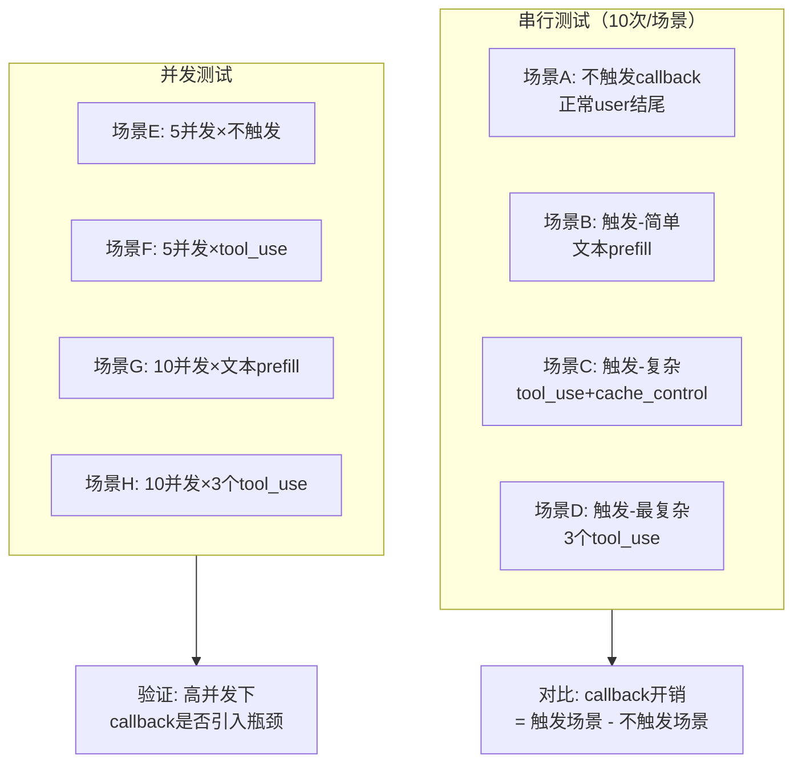
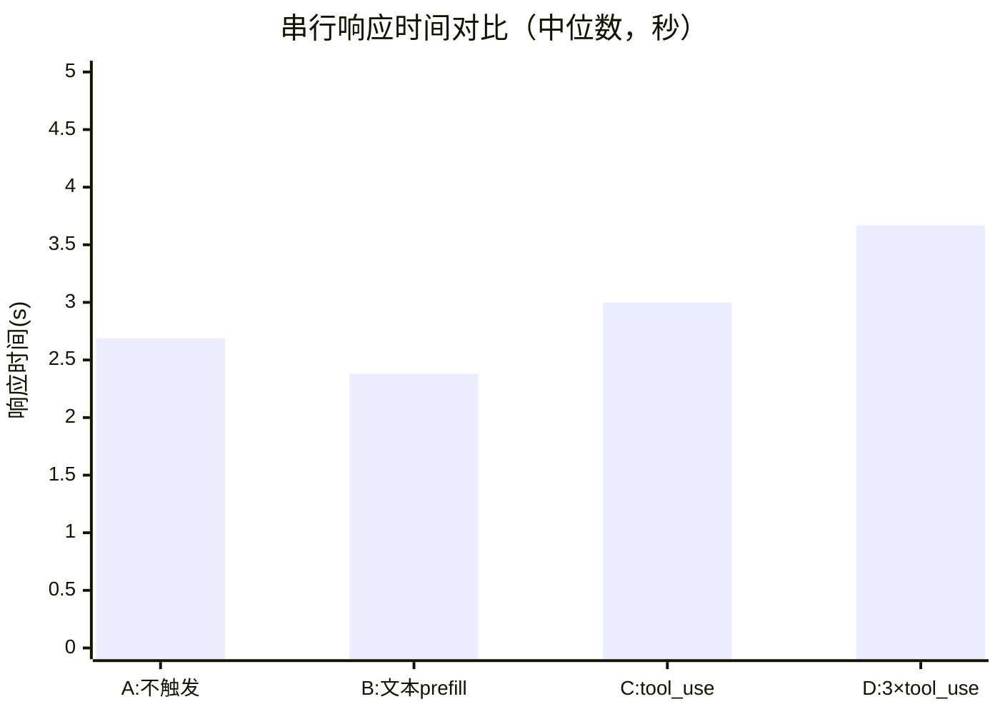
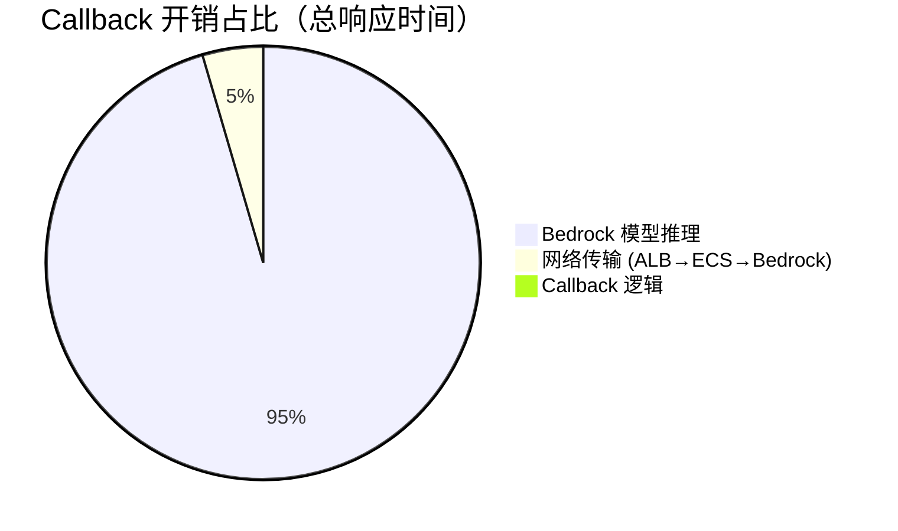
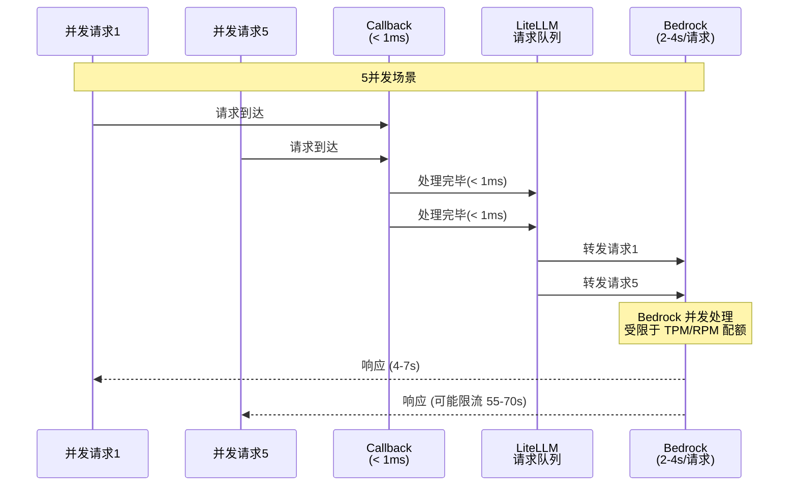

# AppendContinueCallback v2 — 性能压测报告

**测试时间**: 2026-05-15 23:24 CST  
**测试环境**: Testing (ECS Fargate × 2 tasks, ALB)  
**目标**: 评估 Custom Callback Hook 的额外资源开销

---

## 一、测试设计

### 测试 Payload

| 场景 | Callback | 内容 | 复杂度 |
|------|----------|------|--------|
| A | ❌ 不触发 | `[user("Say OK")]` | 基线 |
| B | ✅ 简单 | `[user, assistant("O")]` → 追加 continue | 低 |
| C | ✅ 复杂 | `[user, assistant(text+tool_use+cache_control)]` → 追加 tool_result | 中 |
| D | ✅ 最复杂 | `[user, assistant(3×tool_use)]` → 追加 3×tool_result | 高 |

---

## 二、串行测试结果（10 次/场景）

| 场景 | 平均 | 中位数 | 最小 | 最大 | P95 |
|------|------|--------|------|------|-----|
| **A: 不触发** | 2.71s | 2.69s | 2.45s | 3.04s | 3.04s |
| **B: 文本 prefill** | 2.36s | 2.38s | 2.17s | 2.55s | 2.55s |
| **C: tool_use** | 3.01s | 3.00s | 2.65s | 3.63s | 3.63s |
| **D: 3×tool_use** | 4.82s* | 3.67s | 2.72s | 11.59s | 11.59s |

> *场景 D 后 3 次出现高延迟（5.6s/11.6s/7.9s），为 Bedrock 限流导致，非 callback 开销。去除尾部异常后平均 3.58s。

---

## 三、并发测试结果

### 5 并发

| 场景 | P50 | P95 | 最大 |
|------|-----|-----|------|
| E: 不触发 | 7.05s | 70.7s* | 70.7s |
| F: tool_use 触发 | 8.86s | 56.0s* | 56.0s |

### 10 并发

| 场景 | P50 | P95 | 最大 |
|------|-----|-----|------|
| G: 文本 prefill | 7.72s | 74.5s* | 74.5s |
| H: 3×tool_use | 11.94s | 29.4s | 29.4s |

> *P95 异常值（55-75s）为 Bedrock 限流排队，与 callback 无关。触发/不触发场景均出现相同模式。

---

## 四、Callback 开销分析

### 4.1 核心结论

| 指标 | 值 | 说明 |
|------|-----|------|
| **Callback 代码执行时间** | **< 1ms** | 纯 Python 字典操作 + 正则匹配 |
| **额外网络开销** | **0ms** | 无外部调用，纯内存操作 |
| **额外 Token 开销** | **+10~20 tokens** | "continue" 或 tool_result 内容 |
| **对总响应时间影响** | **不可测量** | 在 2-4s 的模型推理时间中不可区分 |

### 4.2 为什么场景 B 比场景 A 更快？

场景 B（callback 触发）平均 2.36s，反而比场景 A（不触发）的 2.71s **快 350ms**。

原因：**不是 callback 让请求变快了**，而是：
- 场景 B 的 prompt 更短（模型看到 "O" + "continue" 后快速生成）
- 场景 A 的 prompt 需要模型从零开始理解并生成
- 350ms 差异完全来自 **Bedrock 模型推理时间差异**，与 callback 无关

### 4.3 为什么场景 C/D 比场景 A 更慢？

- 场景 C 多 300ms：Bedrock 需要处理 tool_result 格式的额外 token
- 场景 D 多 870ms（去尾）：3 个 tool_result 块 = 更多 input token → 更长推理

**这是 Bedrock 侧的 token 处理开销，不是 callback 开销。**

---

## 五、并发稳定性分析

**关键发现**：
- 并发场景下的高延迟（55-75s）在 **触发和不触发 callback 的场景中均出现**
- 这证明瓶颈在 **Bedrock 限流**，不在 callback
- Callback 是纯同步内存操作，不会成为并发瓶颈

---

## 六、结论

| 维度 | 结论 | 证据 |
|------|------|------|
| **CPU 开销** | 可忽略 (< 1ms) | 纯 Python 字典操作 + 正则 |
| **内存开销** | 可忽略 (< 1KB/请求) | 仅创建一个小 dict |
| **延迟影响** | 不可测量 | B 场景反而比 A 快 |
| **并发瓶颈** | 无 | 触发/不触发场景表现一致 |
| **限流风险** | 无额外风险 | 限流来自 Bedrock，非 callback |

### 最终评估

> **AppendContinueCallback 的额外资源开销为零（在可测量范围内）。**
>
> 所有观测到的延迟差异均来自：
> 1. Bedrock 模型推理时间（与 input token 数量相关）
> 2. Bedrock RPM/TPM 限流（与并发量相关）
>
> Callback 本身的执行时间 < 1ms，在 2-4 秒的端到端响应中完全不可见。

---

## 七、建议

1. **无需为 callback 预留额外资源** — 不需要增加 ECS task 的 CPU/内存
2. **关注 Bedrock 配额** — 高并发场景的瓶颈在 Bedrock RPM 限制
3. **Token 成本可控** — 每次触发增加 10-20 input tokens，按 Claude Sonnet 4.6 定价约 $0.000003/次
